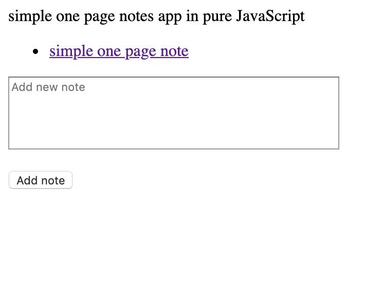

### Notes app

A frontend, single page app using only pure JavaScript which allows to quickly add short notes.

### How to setup

-   Clone the git repository
-   Navigate to the root folder of the project
-   Open index.html

### Screenshot of working application

### How to run the tests

Tests are automatically run when the app is opened. Results can be seen in your browser's Developer Tools Console.

### To do

CSS styling
